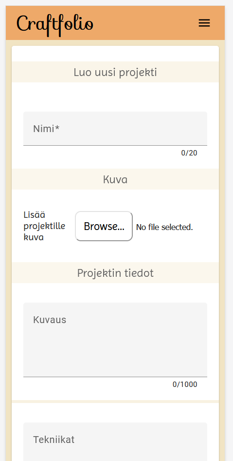

# Design

Ideoin tuotekonseptin yhdessä toisen kurssilaisen kanssa. Jo alkuun voimakas visio. Käyttäjän luoma sisältö olisi pääosassa. Värimaailma kodikas.

## Suunnittelu Figmalla

Olin jo ennestään käyttänyt Figmaa. Emme laatineet lainkaan rautalankamalleja, vaan siirryimme suoraan suunnittelemaan lopullista ulkonäköä.


## Angular Material

Ongelmia kustomoinnin suhteen.

### Painikkeet

Kuinka monta? Parempi yksi komponentti, jota tyylitellään? Angular Material ei salli painikkeiden muotoilua luokkien avulla. Ainoastaan raaka muotoilu komponentin omassa css-tiedostossa toimii. Painikekomponenttien ensisijainen merkitys yhtenäiset tyylit - silloin fiksua olla painikkeita kaikkia tyylejä varten.

```html
<button mat-raised-button type="button">
  <span class="button-content"><ng-content></ng-content>{{label}}</span>
</button>
```

```css
:host {
  /* rajaa komponentin painikkeen kokoon - estää klikkauksen ulkopuolelta */
  margin-right: auto;
}

button {
  padding: 1.6rem;
  border-radius: 0.7rem;
  font-family: Imprima, sans-serif;
  font-size: large;
}

.button-content {
  display: flex;
  flex-direction: row;
  gap: 0.4rem;
  align-items: center;
  align-content: center;
}
```

## Lomakkeet

Syöttökentän koko


