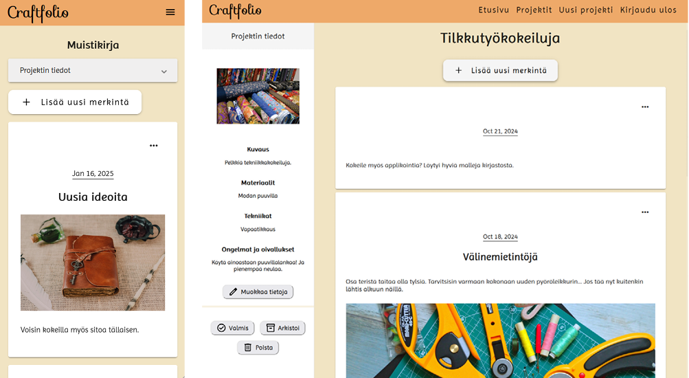

# UI/UX-suunnittelu

Ideoin tuotekonseptin yhdessä toisen kurssilaisen kanssa. Jo alkuun minulla oli voimakas visio sovelluksen käyttöliittymästä. Se olisi minimalistisen miellyttävä ja värimaailmaltaan kodikas. Käyttäjän luoma sisältö olisi pääosassa.

## Suunnittelu Figmalla

Olin jo ennestään käyttänyt Figmaa. Ensimmäisen luonnoksen tein käsin paperille. Figmassa emme laatineet lainkaan rautalankamalleja, vaan siirryimme suoraan suunnittelemaan lopullista ulkonäköä. Alla joitain esimerkkejä.

### Projektinäkymä

Luonnoksia Figmassa. Tavoittelin mahdollisimman selkeää ja kompaktia käyttöliittymää.

Lopullinen projektinäkymä, jonka merkintökortit ja painikkeet ovat tekemiäni.

### Projektilomake

Vasemmalla viimeinen luonnos Figmassa ja oikealla lopulliset näkymät. Tyyli pysyi melko samana, mutta toimintoja karsiutui ja siirtyi eri paikkaan.

### Lista

Alkuperäiseen konseptiin kuului myös lista. Tässä sen Figma-luonnoksia.

## Angular Material sekä CSS

Päätimme käyttää Angular Material -kirjastoa. Se oli juuri päivittynyt kolmanteen versioon eivätkä aiemmat helpot muokkaustavat enää toimineet.

Tapauksesta riippuen tein tyylittelyä sekä komponenttien omiin css-tiedostoihin että yleiseen tyylitiedostoon. Käytin paljon flexboxia.

Tyylittelin omat komponenttini sekä osittain myös sovelluksen muuta ulkonäköä.

## Käytettävyys ja saavutettavuus

Näihin olisin halunnut ehtiä perehtyä enemmän.
