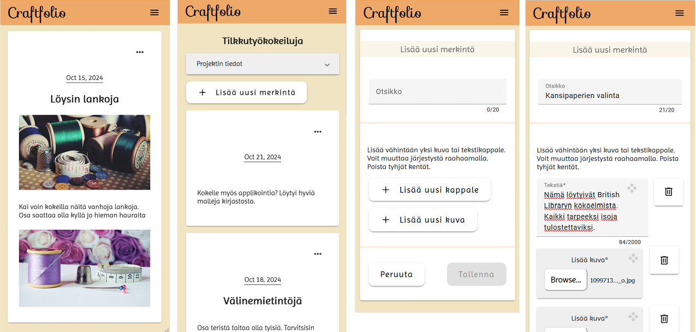

# Dynaaminen lomake

Tein suuren osan sovelluksen komponenteista. Luomis- ja muokkauslomakkeet, projektit-näkymän ja projekti-thumbnailit, projektiin liittyvät dialogit, painikkeet, merkintökortit sekä osan projekti-näkymästä.

Tapausesimerkkinä esittelen tässä merkinnön luomis- ja muokkauslomakkeet. Toteutin ne dynaamisina lomakkeina. Olin aiemmin tehnyt ainoastaan templaattipohjaisia lomakkeita. Dynaamista lomaketta varten minun tuli opetella Angularin reaktiivinen lomake, jonka monipuolisuuteen nopeasti tykästyin.

## Taulukon luonti: FormArray

Halusin tehdä käyttäjän syöttämistä teksteistä ja kuvista olioita. Reaktiivisessa lomakkeessa se oli helppoa. Lisäsin vain haluamani ominaisuudet.

```typescript
// luodaan FormGroup
  updateForm = this.formBuilder.group({
    title: ['', Validators.maxLength(25)],
    // luodaan taulukko
    updateItems: this.formBuilder.array(
      [],
      // taulukossa oltava vähintään yksi olio
      [Validators.required, Validators.minLength(1)]
    ),
  });

  // FormArrayn kutsumiseen
  get updateItems() {
    return this.updateForm.controls['updateItems'] as FormArray;
  }
```

## Kenttien luonti sekä drag-and-drop

Olin jo projektin alussa tarkistanut, että Angular Materialilla on drag and drop -moduuli. Se on kuitenkin tehty tavalliselle taulukolle ja tarvitsin sen FormArraylle. Löysin StackOverflowsta tarvittavan muutoksen enkä lähtenyt rakentamaan sellaista itse.

Etukäteen minua arvelutti, kuinka saan kuvat osaksi samaa taulukkoa tekstikappaleiden kanssa. Jos ne olisivat eri taulukoissa, drag and drop ei toimisi enkä saisi talteen merkintösisältöjen järjestystä. Voiko taulukkoon laittaa kahta erilaista syötettä? Kaikissa näkemissäni dynaamisen lomakkeen esimerkeissä luotiin ainoastaan identtisiä input-kenttiä.

Sitten tajusin, että tekstit ja kuvathan _ovat_ samanlaisia olioita. Ne ovat kumpikin updateItem-tyyppiä. Ne eroavat ainoastaan ominaisuuksiensa arvoissa. Tietysti ne sopisivat samaan taulukkoon.

Haasteeksi jäi, voinko luoda dynaamisesti kahta erilaista input-kenttää. Kokeilin switchiä, ja sehän toimi.

```html
<!-- painike tekstikentän luontiin -->
<app-button-with-icon
  class="form-button"
  (click)="addItem('newText')"
  [label]="'Lisää uusi kappale'"
  ><app-icon-add></app-icon-add
></app-button-with-icon>

<!-- painike kuvakentän luontiin -->
<app-button-with-icon
  class="form-button"
  (click)="addItem('newImage')"
  [label]="'Lisää uusi kuva'"
  ><app-icon-add></app-icon-add
></app-button-with-icon>
```

```typescript
// luodaan uusi syöttökenttä painikkeen perusteella
  addItem(newInput: string) {
    switch (newInput) {
      // tekstikappaleelle
      case 'newText':
        const updateItemForm: FormGroup = this.formBuilder.group({
          text: ['', [Validators.required, Validators.maxLength(2000)]],
          image: '',
          contentType: 'text',
          sequenceNo: -1, // alustusarvo
        });
        this.updateItems.push(updateItemForm);
        break;
      // kuvalle
      case 'newImage':
        const updateImageForm: FormGroup = this.formBuilder.group({
          text: '',
          image: ['', [Validators.required]],
          contentType: 'image',
          sequenceNo: -2, // alustusarvo
        });
        this.updateItems.push(updateImageForm);
    }
  }
```



## Kuvien tallennus

Nyt kenttiä oli mahdollista luoda, poistaa ja liikutella. Enää puuttui kuvien todellinen lisäys. Nopeasti huomasin, että käyttäjän syöttämää kuvatiedostoa ei voi käsitellä ja liikutella kuin normaalia dataa. Olisin halunnut käydä kuvat läpi servicessä. Olisin lähettänyt ne yksitellen S3Bucketiin ja lisännyt olioon kuvan osoitteen. Se ei ollut kuitenkaan mahdollista, sillä kuvien osoite korruptoitui fakepathiksi.

Projektilomakeessa kuvan lisäys tehdään luokkaosassa olevan File-muuttujan avulla. Muuttuja säilöö valittua tiedostoa kunnes lomake tallennetaan. Ennen tietojen lähettämistä eteenpäin kuva viedään S3Bucketiin ja saatu osoite napataan talteen. Tätä projektikuvan tallennusta teki myös toinen tiimiläinen.

```typescript
  // valittu tiedosto tallennetaan muuttujaan
  newImage: File | null = null;

  // valittu tiedosto päivittyy, jos käyttäjä vaihtaa kuvaa
  onFileChange(event: any) {
    if (event.target.files && event.target.files.length > 0) {
      this.newImage = event.target.files[0];
    }
  }

  // lähetetään lomakkeen tiedot
  async onSubmit(formData: any) {
    this.error = '';
    this.submitting = true;
    try {
      let imageUrl: string;
      if (this.newImage) {
        // tallennetaan kuva S3Bucketiin ja otetaan osoite talteen
        imageUrl = await this.projectService.uploadImage(this.newImage);
      } else {
        imageUrl = '';
      }
      const project = await this.store.addProject({
        name: formData.name,
        image: imageUrl,
        ...
      }...)
    ...}
  ...}
```

Dynaamisessa lomakkeessa voi olla kuitenkin lukuisia kuvia – tulisiko niille kaikille luoda dynaamisesti myös oma muuttuja?

Eikä siinä edes kaikki - minun täytyisi pystyä sijoittamaan jokaisesta kuvasta saamani osoite oikeaan olioon. Ja nämä oliothan ovat identtisiä. Ainoastaan indeksi erottaa ne toisistaan ja se voi vaihtua monta kertaa ennen lopullista tallennusta. Tarvittaisiin väliaikaiset id:t ja ties mitä.

Tätä himmeliä en lähtenyt edes kokeilemaan.

Järkevämmältä tuntui, että kuva vietäisiin välittömästi S3Bucketiin ja saatu osoite sijoitettaisiin samantien kyseisen olion tietoihin. Jos käyttäjä venkslaa kuvia edestakaisin, on seurauksena toki turhaa liikennettä. Se on mielestäni kuitenkin pieni hinta verrattuna toisenlaisen ratkaisun monimutkaisuuteen.

```typescript
  // kuvien tallennus
  // seurataan muutoksia fileinput-kentässä
  async onFileChange(event: any, index: number) {
    if (event.target.files && event.target.files.length > 0) {
      this.uploading = true; // latausspinneri näkyviin
      // lähetetään kuva S3Bucketiin ja vastaanotetaan sen url
      const imageUrl = await this.projectService.uploadImage(
        event.target.files[0]
      );
      // sijoitetaan saatu url kyseisen updateItem-olion image-ominaisuuteen
      this.updateItems.value[index].image = imageUrl;
      this.uploading = false; // latausspinneri pois
    }
  }
```

## Merkinnän muokkaus

Käyttäjälle voi tulla tarve muokata jo tekemäänsä merkintää. Tällöin editointilomakkeessa tulisi näkyä merkinnän nykyiset tiedot. Jotta dynaamiset kentät saa näkyviin, on ne ensiksi luotava. Vanhat tekstikappaleet on helppo sijoittaa samalla luotuihin kenttiin.

Mutta mitä teen kuville? Turvallisuussyistä ainoastaan käyttäjä voi lisätä kuvien syöttökenttiin sisältöä.

Ei riitä, että vanhat kuvat ainoastaan näkyvät lomakkeessa kuten projektikuvaa muokatessa. _Drag and drop_ -ominaisuutta varten niiden on kuuluttava samaan taulukkoon kuin muukin merkintösisältö.

Ratkaisuksi keksin kuvan alla piilossa olevan tekstikentän.

```typescript
// haetaan merkinnän nykyiset tiedot projektin ja merkinnän id:n avulla
  getCurrentValues(pid: number, uid: number) {
    const update = this.store.getUpdateById(pid, uid)!;
    // sijoitetaan otsikko otsikkokenttään
    this.updateForm.patchValue({
      title: update.title || '',
    });
    // dynaamisten kenttien tietoja ei voi suoraan sijoittaa (koska kenttiä ei vielä luotu)
    // luodaan kentät ja sijoitetaan samalla tiedot
    for (let upItem of update.updateItems) {
      if (upItem.contentType === 'text') {
        const updateItemForm: FormGroup = this.formBuilder.group({
          id: upItem.id,
          text: upItem.text,
          image: '',
          contentType: 'text',
          sequenceNo: upItem.sequenceNo,
        });
        this.updateItems.push(updateItemForm);
      }
      // kuvia ei voi palauttaa kuvakenttään
      // kuvan osoite syötetään piilossa olevaan tekstikenttään, josta se haetaan näkyviin
      // näin vanha kuva voi olla osa samaa FormArrayta
      if (upItem.contentType === 'image') {
        const updateItemForm: FormGroup = this.formBuilder.group({
          id: upItem.id,
          text: '',
          image: upItem.image,
          contentType: 'old-image',
          sequenceNo: upItem.sequenceNo,
        });
        this.updateItems.push(updateItemForm);
      }
    }
  }
```

Vanhan kuvan osoite sijoitetaan näkymättömissä olevaan input-kenttään ja haetaan sieltä.

```html
<!-- vanhan kuvan näyttö -->
@if (updateItemForm.value.contentType === "old-image") {
<div [formGroupName]="i" class="old-image-div" cdkDrag>
  <mat-card class=" old-image-card">
    <textarea
      matInput
      type="text"
      formControlName="image"
      #oldimage
      class="old-image-input"
    ></textarea>
    <!-- haetaan kuvan osoite syöttökentästä -->
    
    <!-- kahva input-kenttien siirtelyyn -->
    <div class="input-handle" cdkDragHandle>
      <!-- ...tässä olisi kahvaikonin svg-polku... -->
    </div>
  </mat-card>
  <app-button-delete (click)="deleteItem(i)"></app-button-delete>
</div>
}
```

Lopuksi tallennetaan järjestynumerot ja palautetaan vanhojen kuvien tyyppiarvoksi 'image'.

```typescript
// lomakedatan lähetys
  async onSubmit(formData: any) {
    ...
    // otetaan indeksiarvo talteen järjestysnumeroksi
    for (let [index, item] of formData.updateItems.entries()) {
      item.sequenceNo = index;
      // vaihdetaan samalla pois väliaikainen sisältötyyppi
      if (item.contentType === 'old-image') {
        item.contentType = 'image';
      }
    }
    try {
      ...
    } ...
  }
```


